# 🚀 DevOps Fundamentals: Basic to Advanced

Welcome to the **DevOps Fundamentals: Basic to Advanced** repository. This project is a comprehensive guide and resource hub for anyone looking to master DevOps, from foundational concepts to advanced production-grade practices.

## 🗺️ DevOps Learning Roadmap

Below is the visual guide to the journey you'll embark on. This roadmap outlines the key stages and technologies required to become a proficient DevOps Engineer.

---

## 📋 Table of Contents

- [🎯 Phase 1: Foundations](#-phase-1-foundations)
- [🏗️ Phase 2: Core DevOps](#%EF%B8%8F-phase-2-core-devops)
- [🏆 Phase 3: Advanced Practices](#-phase-3-advanced-practices)
- [🚀 Phase 4: Expert Level](#-phase-4-expert-level)
- [🛠️ Suggested Projects](#%EF%B8%8F-suggested-projects)
- [📜 License](#-license)

---

## 🎯 Phase 1: Foundations (3-6 months)

The bedrock of DevOps is a solid understanding of system administration, networking, and version control.

### 🐧 Linux & Shell Scripting
- **Concepts**: File system hierarchy, permissions, process management, users & groups.
- **Skills**: Mastering the CLI (grep, awk, sed, find), SSH, and Bash automation.

### 🌐 Networking Basics
- **Concepts**: OSI Model, TCP/IP, DNS, HTTP/HTTPS, Load Balancing.
- **Skills**: Troubleshooting with `curl`, `ping`, `netstat`, and `dig`.

### 🔀 Version Control (Git)
- **Concepts**: SCM, Branching strategies (GitFlow, Trunk-based).
- **Skills**: Rebasing, resolving conflicts, cherry-picking, and Pull Request workflows.

---

## 🏗️ Phase 2: Core DevOps (6-9 months)

Moving into automation and containerization, the heart of modern DevOps.

### 🐳 Containerization (Docker)
- **Concepts**: Containers vs. VMs, Image layers, Networking, Volumes.
- **Skills**: Writing optimized Dockerfiles, multi-stage builds, and Docker Compose.

### 🔄 CI/CD Pipelines
- **Tools**: GitHub Actions, Jenkins, GitLab CI.
- **Skills**: Automating builds, tests, and deployments (Pipeline as Code).

### 🏗️ Infrastructure as Code (IaC)
- **Tools**: Terraform, CloudFormation.
- **Skills**: Declarative infrastructure, state management, and provider configuration.

### ⚙️ Configuration Management
- **Tools**: Ansible.
- **Skills**: Writing playbooks, inventory management, and agentless automation.

---

## 🏆 Phase 3: Advanced Practices (9-12 months)

Scaling applications and ensuring reliability in production environments.

### ☸️ Container Orchestration (Kubernetes)
- **Concepts**: Pods, Deployments, Services, Ingress, ConfigMaps, Secrets.
- **Skills**: Helm charts, cluster management, and zero-downtime deployments.

### 📊 Monitoring & Observability
- **Tools**: Prometheus, Grafana, ELK Stack (Elasticsearch, Logstash, Kibana).
- **Skills**: Setting up dashboards, alerting rules, and log aggregation.

### 🔒 DevSecOps
- **Concepts**: SAST/DAST, Container scanning, Secrets management.
- **Skills**: Integrating security checks into CI/CD (Trivy, Vault).

---

## 🚀 Phase 4: Expert Level (12+ months)

Specializing in high-level architectural patterns and operational excellence.

- **SRE (Site Reliability Engineering)**: SLIs, SLOs, Error Budgets, and Chaos Engineering.
- **Platform Engineering**: Building Internal Developer Platforms (IDP) and self-service portals.
- **FinOps**: Cloud cost optimization and management.
- **Service Mesh**: Istio, Linkerd for microservices communication.

---

## 🛠️ Suggested Projects

| Phase | Project Idea |
| :--- | :--- |
| **Foundations** | Automate a daily system backup and cleanup using Bash scripts. |
| **Core** | Build a CI/CD pipeline that builds a Docker image and deploys it to a VM. |
| **Advanced** | Deploy a highly available microservices app on Kubernetes with Prometheus monitoring. |
| **Expert** | Implement a GitOps workflow using Argo CD and a Service Mesh. |

---

## 📜 License

This project is licensed under the [MIT License](./LICENSE).

---

Developed with ❤️ by [Ashutosh Kumar](https://github.com/ashutosh-kumar-dev)
